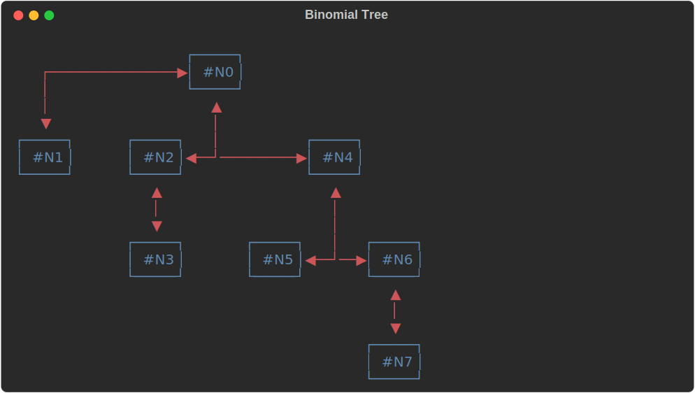

# netext

 

Netext is a graph (network) rendering library for the terminal. It uses the awesome [rich](https://rich.readthedocs.io/en/stable/introduction.html) library to format output and can use different layout engines to place nodes and edges. The library has a very simple API that allows to render graphs created with networkx and integrates well with applications that use rich to output to the terminal. All styling and formatting is done via attributes the nodes and edges of the networkx graph data structures using special attributes keys.

The library is in its early stages and has currently no emphasis on performance, so please do not try to render large graphs with it. While it has been release expect some breaking API changes in the future. Node layout is currently provided by the [grandalf](https://github.com/bdcht/grandalf) library.
